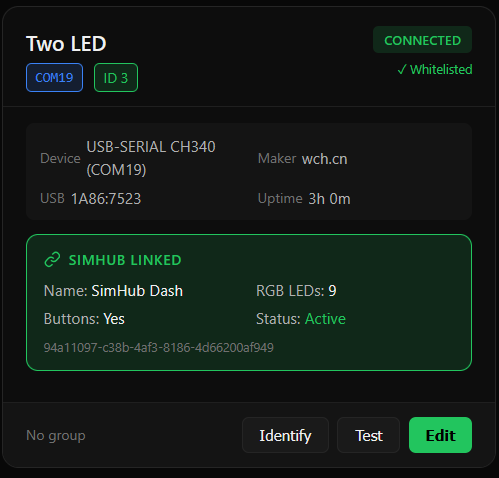

# SimHub Arduino Manager

An experimental but powerful device manager for SimHub Arduino setups.
It gives you a stable, human-friendly registry of all your SimHub Arduinos,
and a fast UI to identify, test, and organize them without fighting COM ports.

---

## ✨ Features

- **Web dashboard**
  - Compact card view for each detected Arduino / COM port
  - Dark / light theme toggle with local persistence
  - Per-card footer showing role, group, and connection duration
- **Stable identity & config**
  - Stable per-device keys based on USB VID / PID / serial
  - Persistent configuration stored in `ports.json`
  - Per-device metadata:
    - Name
    - Role (LED / Gauge / Buttons / Other)
    - Tags
    - Channel (zone)
    - Group (Desk, Wheel, Rig, etc.)
  - Profiles: save/load multiple `ports.json` snapshots
- **Identify & Test flows**
  - Per-device **Identify** action to blink hardware via SimHub
  - Per-device **Test** action for richer patterns
  - Channel-aware identify (`IdentifyChannel`) and mode (`IdentifyMode`) support
- **Hardware details**
  - COM port, USB VID:PID, serial, description, manufacturer
  - "Connected for" indicator derived from first-seen timestamp
- **SimHub Config Integration** *(v0.2.0)*
  - Reads `SerialDashPlugin.json` directly from SimHub's data folder
  - Link local devices to SimHub devices via their Unique ID
  - Shows SimHub metadata on linked cards:
    - Device name, RGB LED count, display modules, motors
    - Button read status, enabled/disabled state
  - Green "SIMHUB LINKED" badge on linked device cards
- **Device Notes & Annotations** *(New in v0.2.2)*
  - Store wiring info for Arduino devices (e.g., "Wires: D4, D5, D7, D8")
  - Custom descriptions for Custom Serial devices (e.g., "Boost Gauge for Audi")
  - Notes for calibration values, PWM ranges, pin assignments
  - Displayed on cards with 📝 Notes header
  - Custom Serial notes stored locally (survives SimHub config changes)
- **Session Statistics** *(v0.2.1)*
  - Track app uptime, identify/test clicks, installs
  - Session start time and last scan time
  - Profiles loaded/saved counts

---

## 🖼 UI Preview

> Dark theme – Arduino Port Manager showing device cards, edit flow, and identify/test state.

**Main dashboard**


**Edit device modal**


**Device card detail**



---

## 🧱 Architecture

- `app.py` – Flask app, routes, profile handling, session stats, and update logic.
- `port_manager.py` – port scanning, config load/save, ID assignment, identify/test triggers, SimHub config reader.
- `templates/index.html` – single-page UI (cards, modals, footer, theming).
- `ports.json` – device registry (generated/maintained automatically).
- `custom_serial_notes.json` – local annotations for Custom Serial devices (auto-generated).
- SimHub reads from: `C:\Program Files (x86)\SimHub\PluginsData\Common\SerialDashPlugin.json`
- Custom Serial config: `C:\Program Files (x86)\SimHub\PluginsData\Common\CustomSerialPlugin.GeneralSettings2.json`
- `plugin/ArduinoIdentifyPlugin` – SimHub C# plugin that exposes:
  - `IdentifyPulse`
  - `IdentifyTargetId`
  - `IdentifyChannel`
  - `IdentifyMode`
  - Actions: `Trigger Identify Blink`, `Trigger Test Pattern`

---

## 🔧 Requirements

- Windows with Python **3.10+**
- [SimHub](https://www.simhubdash.com/) installed and running
- `ArduinoIdentifyPlugin.dll` copied into SimHub’s plugins folder and enabled
- NumPad bindings in SimHub:
  - NumPad **9** → `Trigger Identify Blink`
  - NumPad **0** → `Trigger Test Pattern`

This tool assumes you're already comfortable with basic SimHub plugins and Arduino firmware workflows.

Python dependencies (see `requirements.txt`):

- `Flask`
- `pyserial`
- `pyautogui`
- `requests`

---

## 🚀 Getting Started

From the project root:

```bash
python -m venv .venv
.venv\Scripts\activate
pip install -r requirements.txt
python app.py
```

Then open `http://127.0.0.1:5000` in your browser.

### SimHub setup (plugin install)

1. Copy `ArduinoIdentifyPlugin.dll` into your SimHub plugins folder.
   - Typically: `C:\Program Files (x86)\SimHub\Plugins` or your custom SimHub install path.
   - You can also download the DLL from the latest GitHub release assets.
2. Start SimHub and enable the plugin in the **Plugins** tab.
3. Bind keys in SimHub:
   - NumPad 9 → `Trigger Identify Blink`
   - NumPad 0 → `Trigger Test Pattern`
4. Connect your Arduino devices and start the Flask app.

When you click **Identify** / **Test** in the web UI, the app sends the hotkey,
SimHub calls the plugin action, and your Arduino firmware reacts based on
`IdentifyTargetId`, `IdentifyChannel`, and `IdentifyMode`.

---

## 💾 Profiles

- Profiles are stored as JSON snapshots in the `profiles/` directory.
- Use the **Profiles** dropdown in the header to:
  - **Save** – write the current `ports.json` state to `profiles/<name>.json`.
  - **Load** – replace `ports.json` with the selected profile.

This is ideal for switching between *Desk*, *Rig*, or different sim setups.

---

## ✅ Manual Smoke Test

After installing everything, you can quickly verify the setup with this checklist:

1. **Start services**
   - Launch SimHub with the Arduino Identify plugin enabled.
   - Run `python app.py` and open `http://127.0.0.1:5000`.
2. **Detect device**
   - Plug in an Arduino.
   - Confirm a card appears in the UI with the correct COM port and USB details.
3. **Install / assign ID**
   - Click **Install** on the card.
   - Verify an ID appears on the card header and in `ports.json`.
4. **Edit metadata**
   - Click **Edit**, change name/role/tags/channel/group, and **Save**.
   - Confirm the card updates immediately and `ports.json` reflects the changes.
5. **Add notes** *(v0.2.2+)*
   - Click **Edit**, add notes (e.g., "Wires: D4, D5, D7, D8") and **Save**.
   - Confirm the card shows the 📝 Notes section with your text.
6. **Link to SimHub device** *(v0.2.0+)*
   - Click **Edit** and use the **SimHub Link** dropdown to select a SimHub device.
   - Save and confirm the card shows a green "SIMHUB LINKED" badge with LED count, modules, etc.
7. **Identify / Test**
   - Click **Identify** and check the board blinks the expected identify pattern.
   - Click **Test** and check the board runs the richer test pattern.
8. **Custom Serial notes** *(v0.2.2+)*
   - If you have Custom Serial devices (boost gauge, etc.), click **Edit Notes** on their card.
   - Add a description and notes, then **Save**.
   - Confirm the notes appear on the Custom Serial card.
9. **Persistence**
   - Restart the Flask app and reload the page.
   - Confirm the card, metadata, ID, SimHub link, and notes are all still correct.

If all steps pass, your SimHub Arduino Manager stack is wired correctly end-to-end.

---

## ⚠️ Current Guardrails & Limitations

The app includes a few safety checks:

- Header badges for **SimHub Running / SimHub Not Running**
- Header badges for **Plugin Found / Plugin Missing** (checks for `ArduinoIdentifyPlugin.dll`)
- Identify/Test calls now **fail with a clear error** if SimHub isn’t running or the plugin DLL can’t be found

Known limitation (not yet automatic):

- The NumPad 9 / NumPad 0 hotkey bindings cannot be verified from Python – if they’re not mapped to the plugin actions,
  Identify/Test will still do nothing even though the UI and badges look healthy.

---

## 📓 Versioning & Changelog

This project uses simple semantic-style versions starting from **0.1.0**.
See `CHANGELOG.md` for released versions and the planned roadmap.

---

## 🤝 Contributing

This is an experimental project aimed at making SimHub Arduino workflows nicer.
Issues and pull requests are welcome – ideas around device health, better
SimHub integration, and multi-rig setups are especially appreciated.

> Built in a single late-night session as a proof that a small, focused tool
> can make SimHub Arduino setups feel much more manageable.

